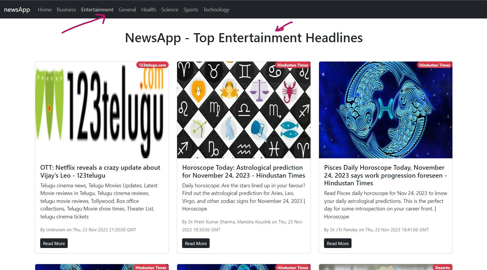

# NewsApp - React JS base Application

NewsApp is a application that keeps user updated regarding all important happenings in the world with help of it's news.

## Categorized News

### A user can navigate through different sections of newsApp and can read news of his desire.

In NewsApp, the whole news is categorized in many categories such as `bussiness`, `health` , `sports` , `entertainment` , `science` , `technology` etc.
A user can click on any of these to read news as per his desire.Either a user is interested in Science & Technology or Entertainment & Health, he could easily read news from `NewsApp`.

### Showing all news from `Entertainment` Category

